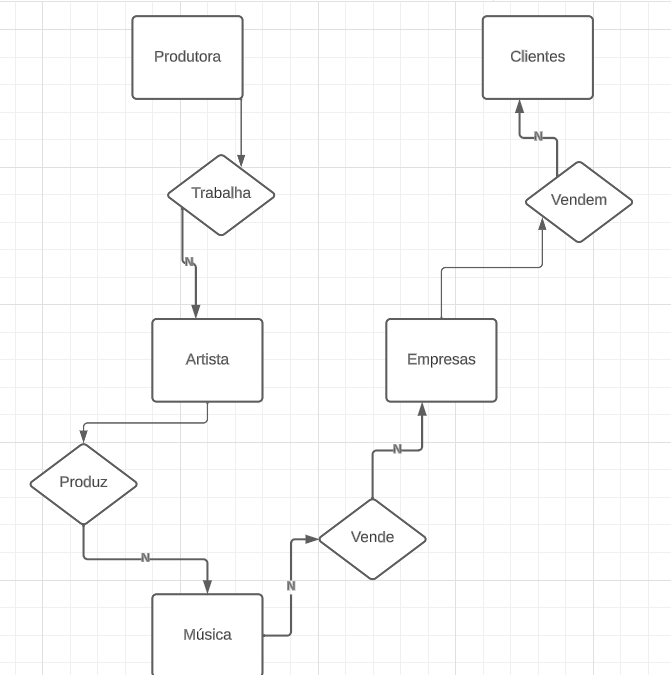
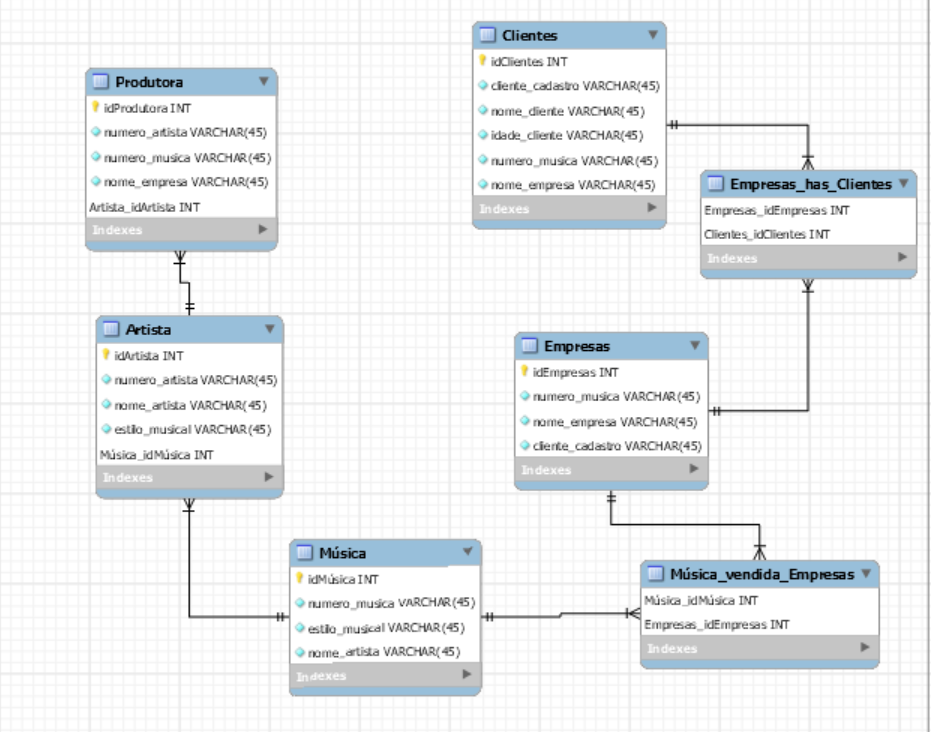

# Banco_de_dados_PRODUTORA

MER:

Workbench:

História:
  
  Uma produtora muito conhecida, trabalha como vários artistas, que possuem um número e um nome. Os artistas produzem muitas músicas que possuem um número e um estilo. As músicas produzidas são vendidas para empresas superfamosas, essas empresas possuem um nome. As empresas vendem as músicas produzidas para seus clientes que possuem um nome, um cadastro e uma idade. 

Schema:

SET @OLD_UNIQUE_CHECKS=@@UNIQUE_CHECKS, UNIQUE_CHECKS=0;
SET @OLD_FOREIGN_KEY_CHECKS=@@FOREIGN_KEY_CHECKS, FOREIGN_KEY_CHECKS=0;
SET @OLD_SQL_MODE=@@SQL_MODE, SQL_MODE='ONLY_FULL_GROUP_BY,STRICT_TRANS_TABLES,NO_ZERO_IN_DATE,NO_ZERO_DATE,ERROR_FOR_DIVISION_BY_ZERO,NO_ENGINE_SUBSTITUTION';

-- -----------------------------------------------------
-- Schema Produtora
-- -----------------------------------------------------
CREATE SCHEMA `Produtora` DEFAULT CHARACTER SET utf8 ;
USE `Produtora` ;

-- -----------------------------------------------------
-- Table `Artista`
-- -----------------------------------------------------

CREATE TABLE `Artista` (
  `idArtista` INT NOT NULL,
  `numero_artista` VARCHAR(45) NOT NULL,
  `nome_artista` VARCHAR(45) NOT NULL,
  `estilo_musical` VARCHAR(45) NOT NULL,
  `Música_idMúsica` INT NOT NULL,
  PRIMARY KEY (`idArtista`, `Música_idMúsica`))
ENGINE = InnoDB;

-- -----------------------------------------------------
-- Table `Clientes`
-- -----------------------------------------------------

CREATE TABLE  `Clientes` (
  `idClientes` INT NOT NULL,
  `cliente_cadastro` VARCHAR(45) NOT NULL,
  `nome_cliente` VARCHAR(45) NOT NULL,
  `idade_cliente` VARCHAR(45) NOT NULL,
  `numero_musica` VARCHAR(45) NOT NULL,
  `nome_empresa` VARCHAR(45) NOT NULL,
  PRIMARY KEY (`idClientes`))
ENGINE = InnoDB;

-- -----------------------------------------------------
-- Table `Empresas`
-- -----------------------------------------------------

CREATE TABLE `Empresas` (
  `idEmpresas` INT NOT NULL,
  `numero_musica` VARCHAR(45) NOT NULL,
  `nome_empresa` VARCHAR(45) NOT NULL,
  `cliente_cadastro` VARCHAR(45) NOT NULL,
  PRIMARY KEY (`idEmpresas`))
ENGINE = InnoDB;

-- -----------------------------------------------------
-- Table `Empresas_has_Clientes`
-- -----------------------------------------------------

CREATE TABLE `Empresas_has_Clientes` (
  `Empresas_idEmpresas` INT NOT NULL,
  `Clientes_idClientes` INT NOT NULL,
  PRIMARY KEY (`Empresas_idEmpresas`, `Clientes_idClientes`))
ENGINE = InnoDB;

-- -----------------------------------------------------
-- Table `Música`
-- -----------------------------------------------------

CREATE TABLE `Música` (
  `idMúsica` INT NOT NULL,
  `numero_musica` VARCHAR(45) NOT NULL,
  `estilo_musical` VARCHAR(45) NOT NULL,
  `nome_artista` VARCHAR(45) NOT NULL,
  PRIMARY KEY (`idMúsica`))
ENGINE = InnoDB;

-----------------------------------------------------
-- Table `Música_vendida_Empresas`
-- -----------------------------------------------------

CREATE TABLE `Música_vendida_Empresas` (
  `Música_idMúsica` INT NOT NULL,
  `Empresas_idEmpresas` INT NOT NULL,
  PRIMARY KEY (`Música_idMúsica`, `Empresas_idEmpresas`))
ENGINE = InnoDB;

-- -----------------------------------------------------
-- Table `Produtora`
-- -----------------------------------------------------

CREATE TABLE `Produtora` (
  `idProdutora` INT NOT NULL,
  `numero_artista` VARCHAR(45) NOT NULL,
  `numero_musica` VARCHAR(45) NOT NULL,
  `nome_empresa` VARCHAR(45) NOT NULL,
  `Artista_idArtista` INT NOT NULL,
  PRIMARY KEY (`idProdutora`, `Artista_idArtista`))
ENGINE = InnoDB;

SET SQL_MODE=@OLD_SQL_MODE;
SET FOREIGN_KEY_CHECKS=@OLD_FOREIGN_KEY_CHECKS;
SET UNIQUE_CHECKS=@OLD_UNIQUE_CHECKS;
